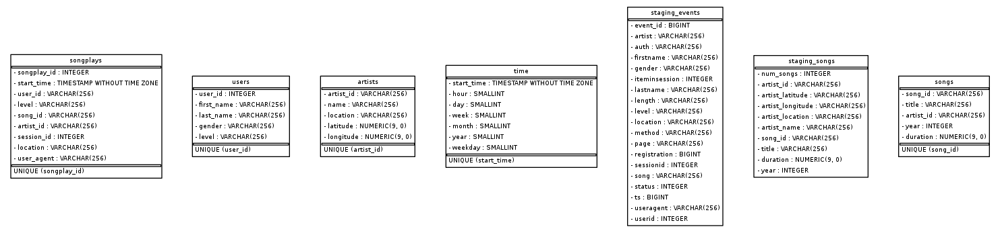

# PROJECT 3: Data Warehouse

## About The Project

- Author: Seyoung Nam
- E-mail: seyoung.nam@gmail.com
- Date: 2021-09-07
- Purpose: Building the database for the analytics purpose from JSON files using AWS resources
- Technologies: Python, PostgreSQL, AWS resources(AWS SDKs, Redshift, S3, VPC, IAM)
- This project is a part of <a href="https://www.udacity.com/course/data-engineer-nanodegree--nd027" target="_blank">Udacity's Data Engineering Nanodegree Program</a>.

<br>

## 1. Quick start

First, we need to open up `evn_setup.ipynb` to set up the AWS working environments. Please follow the directions and run the codes in `evn_setup.ipynb` until STEP 4.

After confirming the DB connection is made in STEP 4, open your terminal and run `create_tables.py` to build vacant tables on Amazon Redshift.

```py
python3 create_tables.py
```

Lastly, run the `etl.py` file to process the JSON data into the created tables.

```py
python3 etl.py
```

Please make sure to revisit `evn_setup.ipynb`, unblock the codes in STEP 5, and run them to close down AWS resources after the project.

<br>

## 2. Files in the repository

- `create_erd.ipynb` plots the ER Diagram of the current DB on Amazon Redshift.
- `create_tables.py` builds your DB tables on Amazon Redshift.
- `dwh.cfg` contains arguments required to set up your AWS environments and to use its resources.
- `env_setup.ipynb` contains codes to set up your AWS working environments.
- `etl.py` inserts data into DB tables.
- `README.md` introduces the project and its usage guidelines.
- `sparkifydb_erd.png` depicts the ER Diagram of the DB.
- `sql_queries.py` contains postgreSQL commands.

<br>

## 3. Database design

The current database has a star schema, consisting of one fact and four dimension tables. The `songplays` table, a fact table, captures users' activity in the music app and the rest tables such as `users`, `songs`, `artists`, and `time` represents basic information of participants and resources related to its business.

The two staging tables - `staging_events` and `staging_songs` - are the representation of raw JSON files that later would be used to build the dimensional data model.

Please refer to the following DB schema.



<br>

### 4. ETL pipeline

| Extract             | Transform   | Load             |  
| ------------------- | ----------- | ---------------- |
| from "song_data" in S3 to "staging_songs" | N/A         | "songs" table    |
| from "song_data" in S3 to "staging_songs" | N/A         | "artists" table  |
| from "log_data" in S3 to "staging_events" | Extract the hour, day, week, month, year, and weekday from the timestamp | "time" table     |
| from "log_data" in S3 to "staging_events" | N/A         | "users" table     |
| Four tables (songs, artists, time, users)  | N/A         | "songplays" table     |

<br>


